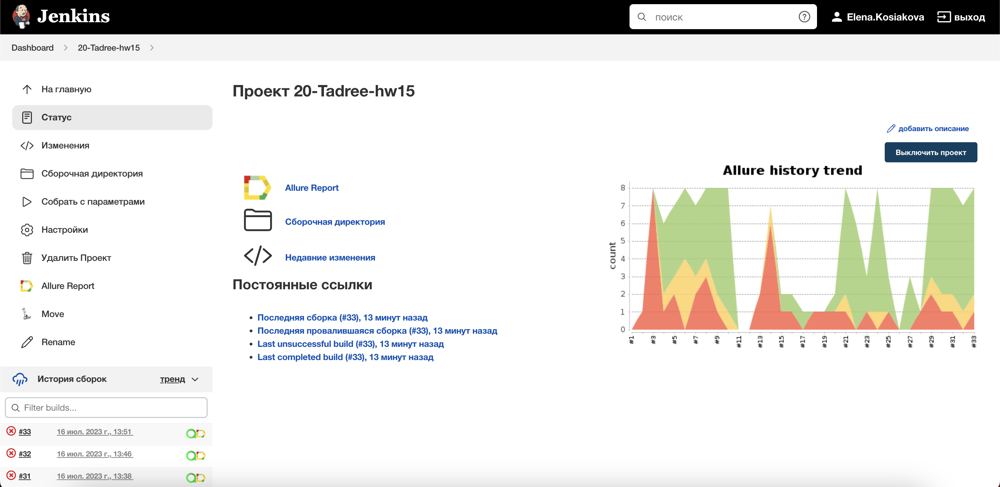
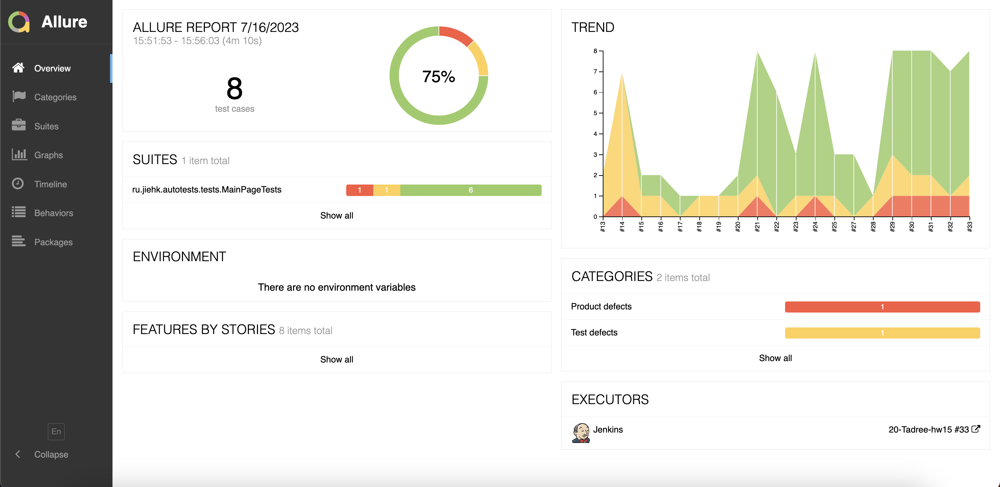
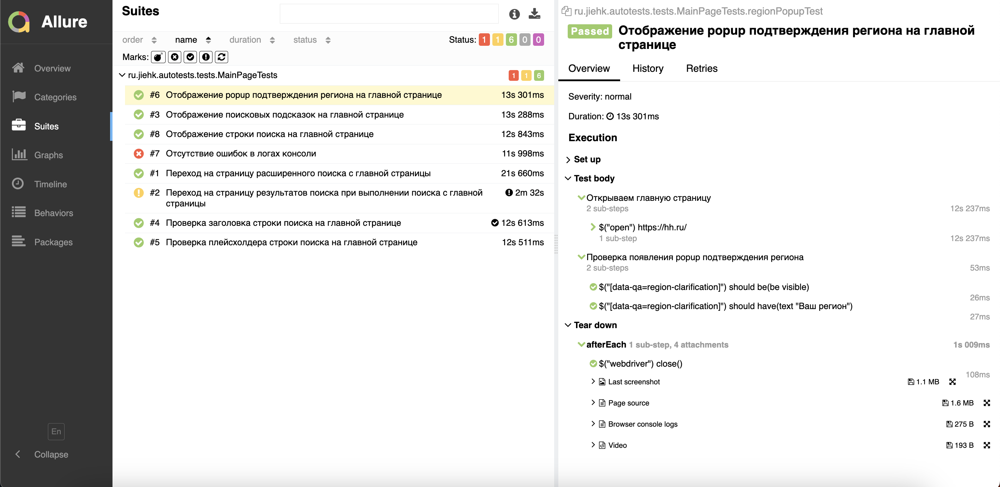
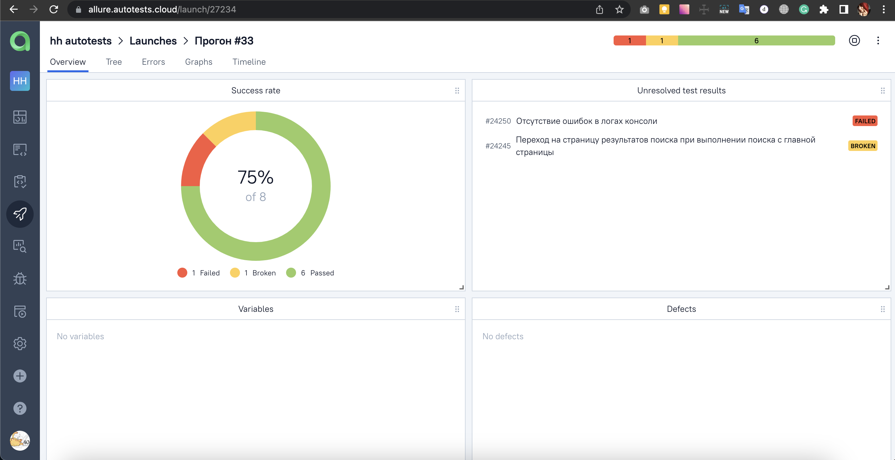
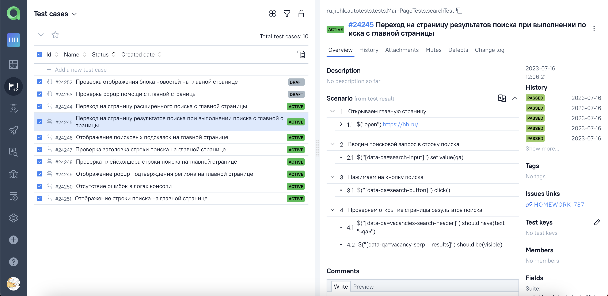
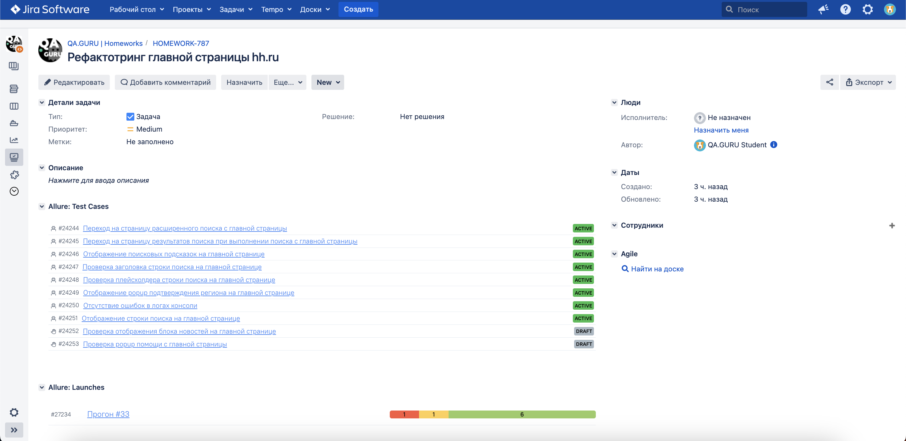
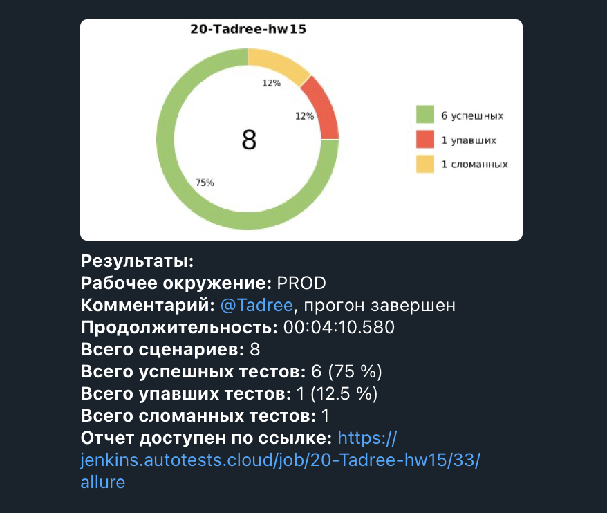
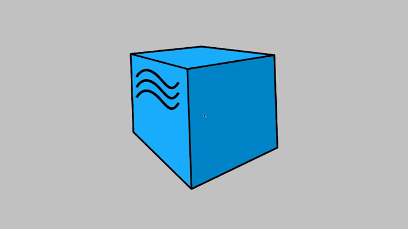

# Проект по автоматизации тестирования hh.ru

### Технологии и инструменты:
<p align="center">


</p>

### Реализованные проверки:
* Отображение строки поиска на главной странице
* Проверка плейсхолдера строки поиска на главной странице
* Переход на страницу результатов поиска при выполнении поиска с главной страницы
* Переход на страницу расширенного поиска с главной страницы
* Отображение поисковых подсказок на главной странице
* Проверка заголовка строки поиска на главной странице
* Отображение popup подтверждения региона на главной странице
* Отсутствие ошибок в логах консоли

### Запуск тестов из терминала
#### Локальный запуск тестов с параметрами из конфигурационного файла:
```bash
gradle clean test -Denv=local
```
#### Удаленный запуск тестов с параметрами из конфигурационного файла:
```shell
gradle clean test -Denv=remote
```

#### Удаленный запуск тестов с передачей параметров:

```bash
gradle clean test 
-Dbrowser=${BROWSER}
-DbrowserVersion=${BROWSER_VERSION}
-DbrowserSize=${BROWSER_SIZE}
-DremoteDriverUrl=https://user1:1234@${REMOTE_DRIVER_URL}/wd/hub/
-DvideoStorage=https://${VIDEO_STORAGE}/video/
```
где: 

- <code>BROWSER</code> – браузер, в котором будут выполняться тесты.
- <code>BROWSER_VERSION</code> – версия браузера, в которой будут выполняться тесты.
- <code>BROWSER_SIZE</code> – размер окна браузера, в котором будут выполняться тесты.
- <code>REMOTE_URL</code> – адрес удаленного сервера, на котором будут запускаться тесты.
- <code>VIDEO_STORAGE</code> - адрес удаленного сервера, по которому можно получить видео.

### Сборка в [Jenkins](https://jenkins.autotests.cloud/job/20-Tadree-hh.ru/)
<p align="center">

</p>

### Отчет в Allure report
#### Основная страница отчета
<p align="center">

</p>

#### Тест-кейсы
<p align="center">

</p>

### Интеграция с [Allure TestOps](https://allure.autotests.cloud/project/3515/dashboards)
#### Dashboard
<p align="center">

</p>

#### Тест-кейсы
<p align="center">

</p>

### Интеграция с [Jira](https://jira.autotests.cloud/browse/HOMEWORK-787)
<p align="center">

</p>

### Уведомления в Telegram с использованием бота
<p align="center">

</p>

### Пример видео выполнения теста на Selenoid
<p align="center">
  
</p>